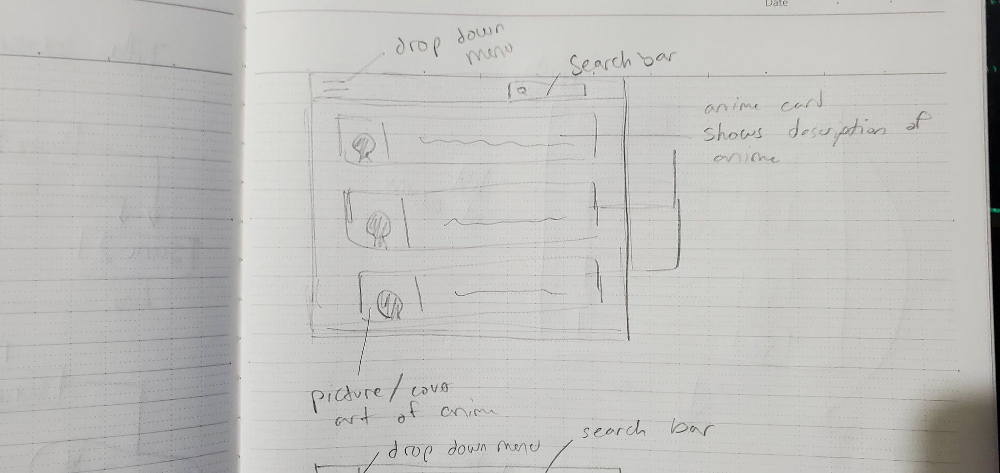
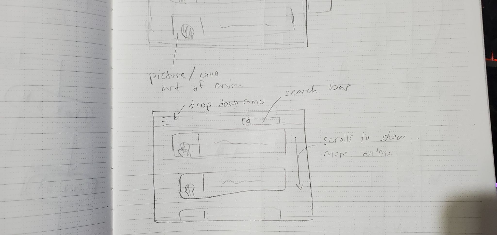
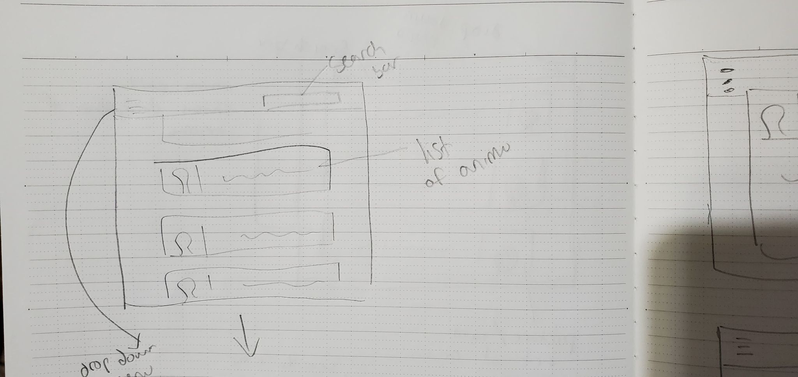
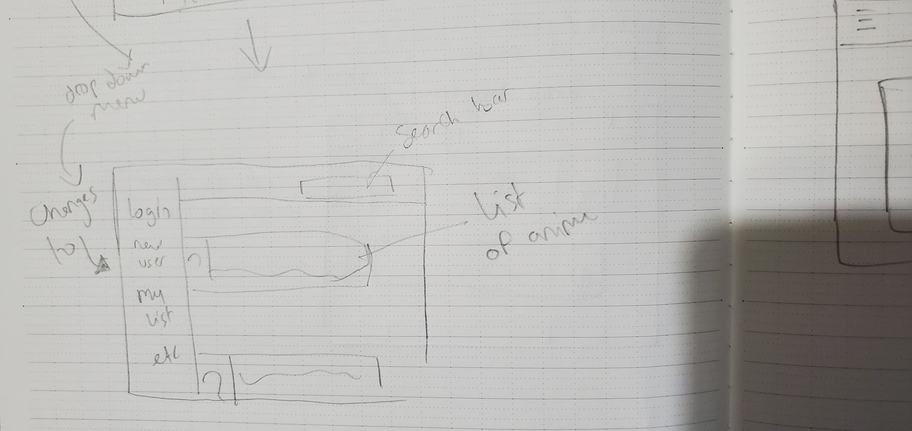
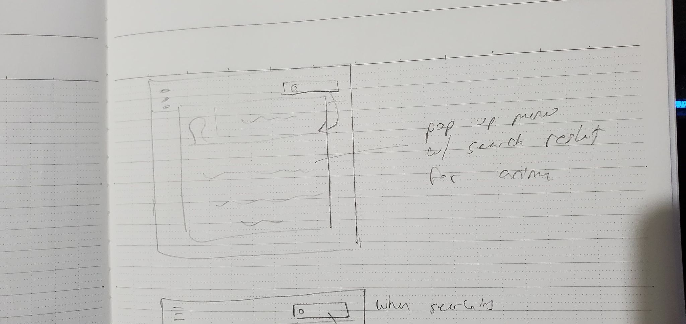
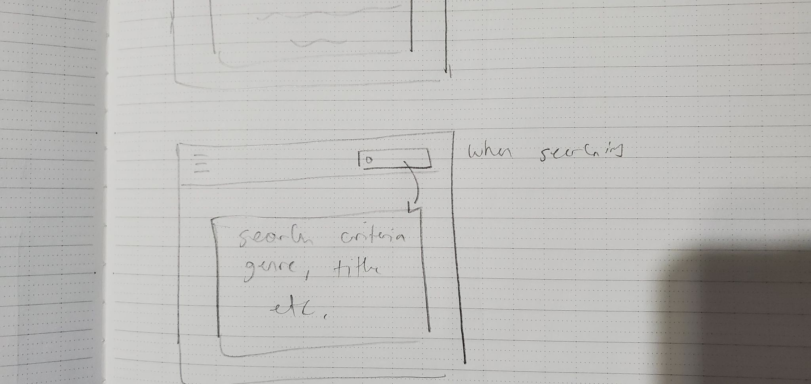
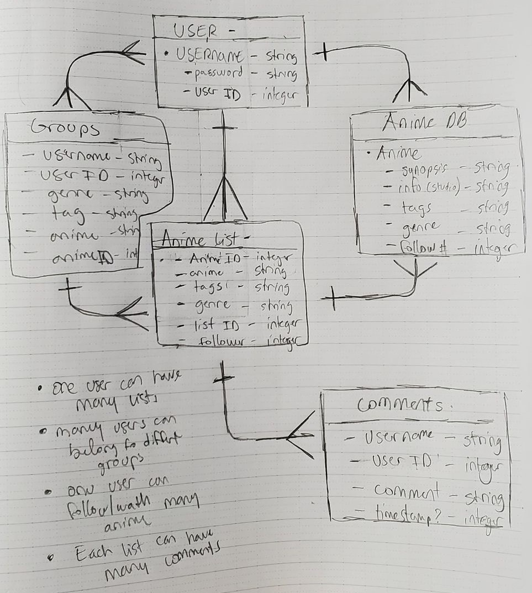

# Project Two

========================================================================

This project aims to use the Jikan API, the unofficial mynanimelist API to allow users to search, follow, and create anime lists to keep up with seasonal/favorite shows to watch. It aims to provide users with the ability to search for and easily maintain a list so they can always have something to watch!

========================================================================

## Installation instructions

>If you would like to adapt the Anime-List app for your own use with a different API

1. Fork and clone this repository
    - Install dependencies needed: npm i
        - bcryptjs
        - connect-mongo
        - dotenv
        - express
        - express-session
        - liquid-express-views
        - method-override
        - mongoose
        - morgan
        - node-fetch
2. Prepare the local host server
    - Create a .env file in the root folder
        - inside .env
            - set PORT=3000
            - if developing the app locally
                - set the DATABASE_URI
            - if developing online
                - set MONGODB_URI
3. Changing the API
    - within './controller/anime_routes.js'
        - find the POST route ('/search')
            - replace the API with whatever API you are using
            - follow the same format as the existing API
        - find the GET route ('/')
            - replace the API with whatever API you are using
        - find the GET route ('/:id')
            - replace the API with whatever API you are using
    - be sure to change the Schema to adapt to your new API
        - Schema can be found in ('./models/anime.js')
        - within ('./controller/anime_routes.js')
            - change the POST route with the key values of your new Schema

## How to use Anime-List

* Begin by creating an account
* Create a list by navigating to the New List tab in the navbar
* Name the list whatever you like, and provide a description for yourself, separate tags with commas
* Popular Anime will be displayed on the homepage for you to get started
* If you already have a show in mind, use the search bar at the top right to look for it
* After searching, view an Anime you would like to add to your list
* Use the dropdown menu to choose which list to add Anime to and select "Add" to add it to that list
* Click on the My List tab to view all the lists you have created
* Within the index of My List you can choose to View, Edit or Delete any list you have made
* Inside of each list you can view all the anime you have added, or delete them

## User Story

>As a user I would like to

- [x] On page load
    - [x] View popular anime
    - [] View popular user lists
    - [x] View my list
    - [x] Drop down Menu
        - [x] Create account
        - [x] Login
        - [x] Search anime
- [x] View a list of anime upon search
    - [x] Search for anime by genre
    - [] Possibly sort anime by season/year
- [x] Add to my list what anime
    - [] I have watched
    - [x] I am currently watching
    - [] What I plan to watch
    - [x] Customize the name of the anime list (“ex: My top 10 shounens”
- [x] View a synopsis for anime, along with:
    - [x] Art
    - [] Promo Material
    - [] Videos
- [x] Possibly add a rating system by users
    - [x] Rates the anime
    - [] Rates the list by user
- [] Have different users comment on my list
    - [] Possibly combine the rating system with the comment system
    - [] (ex: 2 / 5 stars ‘This anime made me cry, but not in a good way)
- [] Have the ability to comment on other user’s list
- [x] View other users’ lists
    - [x] Allow users to create tags for their list

## EXTRAS (Future Goals)
- [x] Create a page for the users that shows all of their lists / info
    - [] Allow for user to customize avatar
    - [] Allow users’ to follow/subscribe to one another 
- [] Allow users to create groups with each other
- [] Anime recommendations based on user list/follows

## My Approach
- Understand the Jikan API and determine which information I can use
    - Build a database using:
        - Tags/genre
        - Title / alt. Title
        - Promotional material / art
        - Synopsis
        - Database ID
        - Studio information / related media
- Create RESTful routes for the user’s list
- Index
    - Displays user’s list
    - displays all anime (beginning with current season, 20-50 anime per pg)
- New 
    - Show form to create a list of anime
- Create 
    - Adds a list to the database (to be viewed by self and other users) then redirect to it
- Show 
    - using database ID to show user list (or another user’s list using ID)
- Edit 
    - Show user a form to edit existing list information (maybe they suddenly dislike a show)
- Update
    - Implement changes made from the edit page
- Destroy
    - Delete a list from a user’s session
- Once all the routes are completed, style the pages (maybe with bootstrap)

## Route Table

|Name:|Path:|HTTP Verb|Purpose|
|:---|:---|:---|:---|
|Anime|---|---|---|
|Show|`/:id`|GET|Displays full information on anime from API|
|Show|`/search`|POST|Finds then displays single anime from API query|
|Show|`/`|GET|Display a list of popular anime|
|Create|`/create`|POST|Adds anime to owned DB|
|Destroy|`/delete/:listId/:animeId`|DELETE| Removes anime from user's list|
|List|---|---|---|
|Index|`/mine`|GET|Shows all of user's made list(s)|
|Show|`/mine`/:id|GET|Shows the contents of a user's list|
|Create|`/mine`|POST|Create a user's list|
|Edit|`/mine/:id/edit`|GET|Display user's edit list form|
|Update|`/mine/:id`|PUT|Updates a user's list|
|Destroy|`/mine/:id`|DELETE|Deletes a user's list|
|User|---|---|---|
|New|`/signup`|GET|Shows form to make new user
|Create|`/signup`|POST|Makes DB request for user|
|Show|`/login`|GET|Renders user login page|
|Create|`/login`|POST|Logs in user then redirects|
|Show|`/logout`|GET|Logs user out then redirects|
|Comments|---|---|---|
|Create|`/:listId`|POST|Creates a comment in a user's list|
|Destroy|`/delete/:listId/:commId`|DELETE|Removes a comment|

## Initial model ideas
- List.js save a unique ID for each anime in our database that can be added to our list
- Anime.js will hold the schema that parses through the database and displays them
- Users.js will simply hold username and password information in it’s own schema
- Comment.js similar to users but will be used for comments to be posted on each list/show or anime/show

## Initial Ideas / Wireframes:

